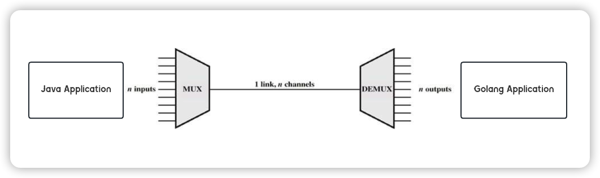
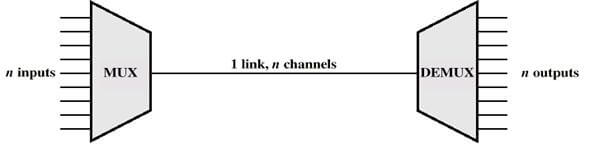

# The Java Implementation of Smux

## Description

The Java Implementation of Smux, The [original repo](https://github.com/xtaci/smux) is implemented by golang. 

You can use this library, to connect java and golang, if you are building a multi-language microservice cluster, it is very useful.




## Benchmark

todo

## Usage

todo

## Status

Dev

---


# Reference description from go repo [xtaci/smux](https://github.com/xtaci/smux)





## Introduction

Smux ( **S**imple **MU**ltiple**X**ing) is a multiplexing library for Golang. It relies on an underlying connection to provide reliability and ordering, such as TCP or [KCP](https://github.com/xtaci/kcp-go), and provides stream-oriented multiplexing. The original intention of this library is to power the connection management for [kcp-go](https://github.com/xtaci/kcp-go).

## Features

1. ***Token bucket*** controlled receiving, which provides smoother bandwidth graph(see picture below).
2. Session-wide receive buffer, shared among streams, **fully controlled** overall memory usage.
3. Minimized header(8Bytes), maximized payload.
4. Well-tested on millions of devices in [kcptun](https://github.com/xtaci/kcptun).
5. Builtin fair queue traffic shaping.
6. Per-stream sliding window to control congestion.(protocol version 2+).


## Benchmark
```
$ go test -v -run=^$ -bench .
goos: darwin
goarch: amd64
pkg: github.com/xtaci/smux
BenchmarkMSB-4           	30000000	        51.8 ns/op
BenchmarkAcceptClose-4   	   50000	     36783 ns/op
BenchmarkConnSmux-4      	   30000	     58335 ns/op	2246.88 MB/s	    1208 B/op	      19 allocs/op
BenchmarkConnTCP-4       	   50000	     25579 ns/op	5124.04 MB/s	       0 B/op	       0 allocs/op
PASS
ok  	github.com/xtaci/smux	7.811s
```

## Specification

```
VERSION(1B) | CMD(1B) | LENGTH(2B) | STREAMID(4B) | DATA(LENGTH)  

VALUES FOR LATEST VERSION:
VERSION:
    1/2
    
CMD:
    cmdSYN(0)
    cmdFIN(1)
    cmdPSH(2)
    cmdNOP(3)
    cmdUPD(4)	// only supported on version 2
    
STREAMID:
    client use odd numbers starts from 1
    server use even numbers starts from 0
    
cmdUPD:
    | CONSUMED(4B) | WINDOW(4B) |
```
